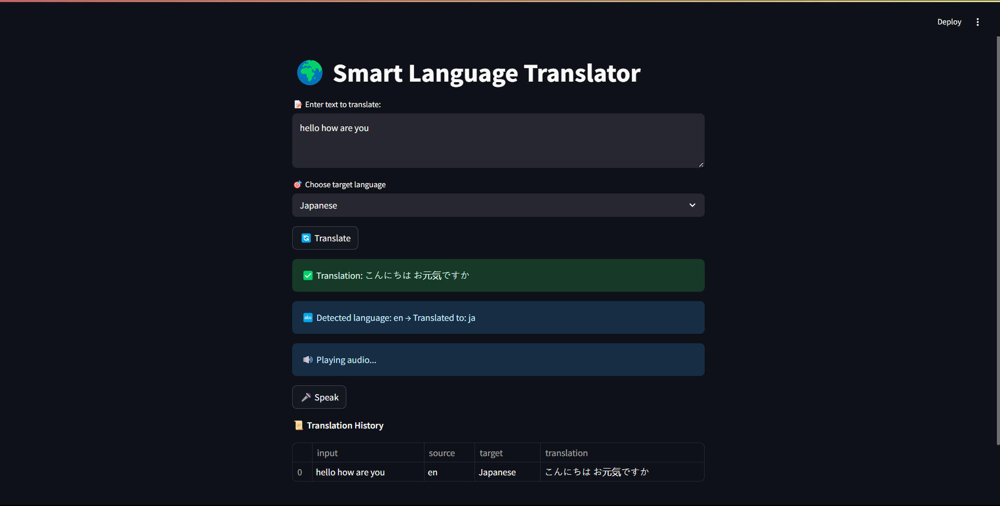

# 🌍 Multilingual Language Translator App



A smart, interactive language translator built using Python and Streamlit.

## ✨ Features

- Real-time text translation
- Auto-detect source language
- Text-to-speech output (supports English and some Indian languages)
- Voice input (speech-to-text)
- Translation history tracking
- Support for **all major Indian languages**:
  - Hindi, Telugu, Tamil, Kannada, Malayalam, Bengali, Marathi, Gujarati, Punjabi, Urdu, Odia
- Easy to run with virtual environment

## 🚀 Live Demo

[](https://language-translator-app-dt6mwv67zfst6loyg4vwbg.streamlit.app/)

## 🛠️ Tech Stack

- Python
- Google Translate API
- SpeechRecognition
- gTTS (Google Text-to-Speech)
- Streamlit (for UI)

## 🚀 How to Run

1. Clone the repo:
   ```bash
   git clone https://github.com/ <your-username>/language-translator-app.git
   cd language-translator-app